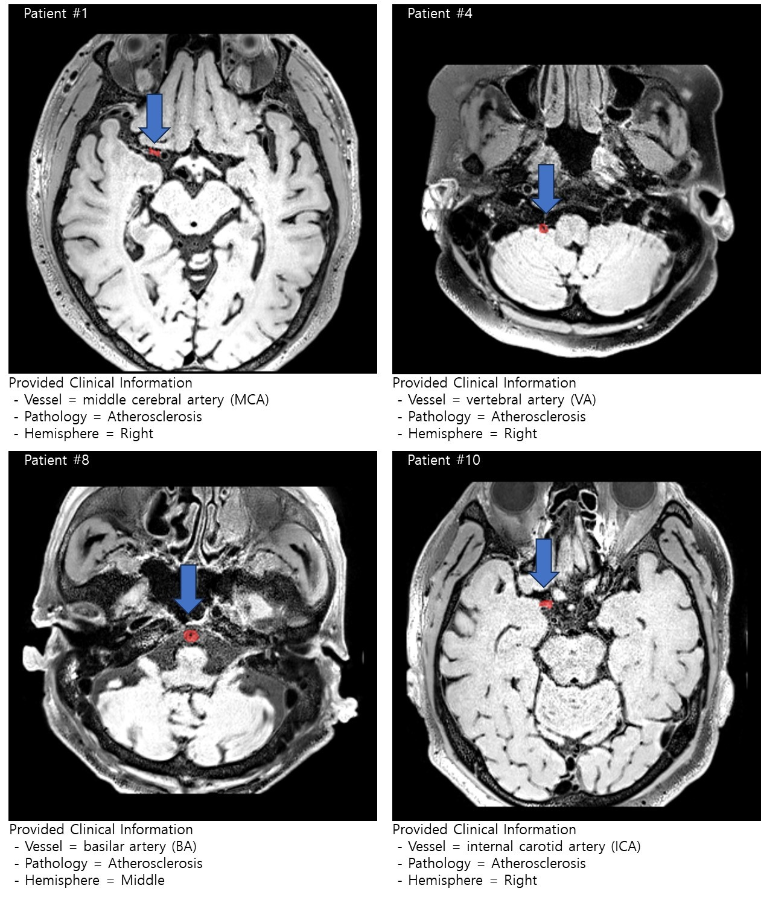

# 2023-Asan-Help-Challenge-topic4-1st-solution
to be continued..

# HeLP 2023 Contest - Theme 4: Vascular Wall Lesion Detection in MRI Images

## Overview

We are delighted to announce that our team, comprised of members from the Catholic University of Korea Seoul St. Mary's Hospital and myself (Kanghoon Lee), clinched the first place in the HeLP 2023 contest. The contest, hosted by Seoul Asan Medical Center, the Ministry of Health and Welfare, the Ministry of Science and ICT, and the Center for Medical Data, featured diverse themes, with our focus centered on Theme 4.

## Theme 4: Vascular Wall Lesion Detection in MRI Images

The challenge posed in Theme 4 centered around the detection of vascular wall lesions in MRI images through segmentation. Despite the inherent difficulty associated with the small scale of the lesions, our team tackled the task with unwavering dedication.

## Team Members

- Prof. Cheon Wonjoong
- Kanghoon Lee (Myself, Medical Engineering Student)
- Prof. Kang Youngnam
- Prof. Lee Youngkyu

We extend our gratitude for the invaluable support and guidance provided by our esteemed professors, which significantly contributed to the success of our project.

---

**Note:** Feel free to adjust the content based on any additional details or specific achievements you would like to emphasize.

# Scientific Overview

Vessel wall magnetic resonance imaging (VW-MRI) enables direct visualization of the vessel wall and its pathology with high spatial resolution and excellent soft tissue contrast. It has been increasingly used as an adjunct to digital subtraction angiography and MR angiography in establishing the etiology for intracranial stenosis. Estimating plaque burden and vulnerability in patients with intracranial atherosclerotic disease is essential in risk assessment and guiding clinical management. In addition, VW-MRI may reveal the characteristic features of intimal flap, double lumen, or intramural hematoma seen in dissection. While lesion segmentation on VW-MRI is important in lesion evaluation and monitoring disease progression, segmentation of mural lesions on VW-MRI is limited by the clinically feasible spatial resolution of VW-MRI and complex geometry of vascular pathology. Automatic lesion segmentation on VW-MRI will improve reproducibility and enable subsequent analysis in the quantitative measurement and radiomics pipeline.

# Challenge Questions

Develop an AI model to accurately segment vessel wall lesions on high-resolution T1-weighted images.

# Data Description

## Data Set
- 80 stroke patients (50 for Training and 30 for Validation)

## Clinical Data and Label
- Location of the lesion in vessel category and pathology of the lesion
  - Vessel category: 1 = ICA, 3 = MCA, 5 = BA, 6 = VA (ICA = internal carotid artery, MCA = middle cerebral artery, BA = basilar artery, VA = vertebral artery)
  - Pathology: 1 = Atherosclerosis, 4 = Vasculitis
  - Hemisphere: Left / Middle / Right indicate the hemisphere of lesion location

## Image Data
- T1-weighted image and Lesion mask (lesion mask is the target label)
  - Acquisition protocol: The T1-weighted image was acquired using a 3.0-T MRI scanner (Skyra, Siemens; TR/TE = 900ms/15ms, flip angle = 120, Acquisition Matrix = 320 x 320, FOV = 192 x 192, slice thickness = 0.6mm without gap).
  

## Infarct Lesion Mask
- Infarct regions were manually segmented on the T1-weighted image by an expert neuroradiologist.

## Data Format
- The brain MRI and lesion mask are provided in compressed NifTi format (.nii.gz). Surface of image data was eliminated for anonymization. All the image data will be provided in its acquisition space without preprocessing.

### T1_Space Folder
- T1_FOV.nii.gz
- ROI.nii.gz (training data will be provided, i.e., VW_Subject001 ~ VW_Subject050)

# Evaluation Matrix

## Requirements for Participants in Submission
- Submit excel (list of filename) and NifTi files (predicted lesion mask by model, binary).
- NifTi files (predicted lesion mask) should be contained in a file (e.g., OOO.zip / OOO.tar.gz) (e.g., VW_Subject001_ROI.nii.gz ~ VW_Subject080_ROI.nii.gz).

## Evaluation
- Average dice similarity coefficient (DSC) in validation data.
